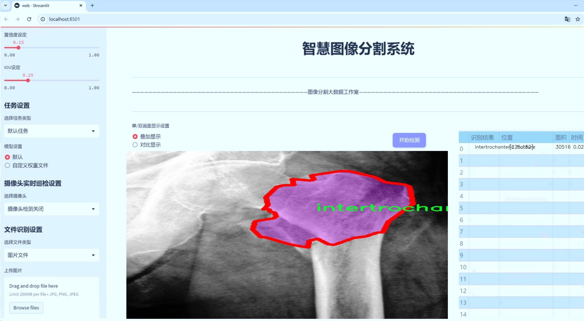

# 髋关节骨折分割系统： yolov8-seg-p2

### 1.研究背景与意义

[参考博客](https://gitee.com/YOLOv8_YOLOv11_Segmentation_Studio/projects)

[博客来源](https://kdocs.cn/l/cszuIiCKVNis)

研究背景与意义

髋关节骨折是一种常见的老年人骨折类型，通常由跌倒或其他外力引起，严重影响患者的生活质量和功能恢复。根据世界卫生组织的统计，髋关节骨折的发生率在全球范围内逐年上升，尤其是在老龄化社会中，相关的医疗负担和社会成本也随之增加。因此，及时、准确地诊断和分割髋关节骨折的影像信息，对于制定有效的治疗方案和提高患者的康复效果具有重要意义。

传统的髋关节骨折诊断方法主要依赖于放射科医生的经验和判断，虽然这些方法在一定程度上能够提供有效的诊断结果，但由于人眼观察的局限性和主观性，常常导致漏诊或误诊的情况发生。此外，随着医学影像技术的不断发展，影像数据的数量和复杂性也在急剧增加，人工分析的效率和准确性面临着严峻挑战。因此，亟需一种高效、准确的自动化影像分析系统，以辅助医生进行髋关节骨折的诊断和治疗。

近年来，深度学习技术在医学影像分析领域取得了显著进展，尤其是目标检测和实例分割任务中，卷积神经网络（CNN）已成为主流方法。YOLO（You Only Look Once）系列模型因其高效的实时检测能力和良好的精度，广泛应用于各种目标检测任务。YOLOv8作为该系列的最新版本，进一步提升了模型的性能和适用性，尤其在实例分割方面表现出色。因此，基于改进YOLOv8的髋关节骨折分割系统的研究，具有重要的学术价值和实际应用意义。

本研究利用包含1700幅影像的髋关节骨折数据集，涵盖了三类重要的骨折类型：股骨粗隆间骨折、颈骨折和正常状态。这一数据集为模型的训练和验证提供了丰富的样本，能够有效提高模型的泛化能力和准确性。通过对数据集的深入分析和处理，结合YOLOv8的先进特性，我们旨在构建一个高效的髋关节骨折分割系统，能够自动识别和分割不同类型的骨折区域，为临床医生提供精准的影像辅助。

本研究的意义不仅在于提升髋关节骨折的诊断效率，更在于推动深度学习技术在医学影像分析中的应用。通过对YOLOv8模型的改进和优化，我们希望能够为未来的医学影像处理提供新的思路和方法，促进智能医疗的发展。此外，该系统的成功应用也将为其他类型的骨折或医学影像分析任务提供借鉴，推动整个领域的技术进步。

综上所述，基于改进YOLOv8的髋关节骨折分割系统的研究，不仅具有重要的理论价值，也具备广泛的临床应用前景。通过本研究，我们期待能够为髋关节骨折的早期诊断和治疗提供有力支持，最终改善患者的预后和生活质量。

### 2.图片演示




注意：本项目提供完整的训练源码数据集和训练教程,由于此博客编辑较早,暂不提供权重文件（best.pt）,需要按照6.训练教程进行训练后实现上图效果。

### 3.视频演示

[3.1 视频演示](https://www.bilibili.com/video/BV1GrUtY8EaK/)

### 4.数据集信息

##### 4.1 数据集类别数＆类别名

nc: 3
names: ['intertrochanteric fracture', 'neck-fracture', 'normal']


##### 4.2 数据集信息简介

数据集信息展示

在本研究中，我们使用的数据集名为“hip fracture yolo”，该数据集专门设计用于训练和改进YOLOv8-seg模型，以实现髋关节骨折的高效分割。髋关节骨折是一种常见的老年人伤害，准确的分割和识别对于临床诊断和治疗方案的制定至关重要。因此，构建一个高质量的数据集是实现这一目标的基础。

“hip fracture yolo”数据集包含三种主要类别，分别是“intertrochanteric fracture”（股骨粗隆骨折）、“neck-fracture”（颈部骨折）和“normal”（正常骨骼）。这三类标签的选择反映了髋关节骨折的不同类型和状态，为模型提供了丰富的学习样本。股骨粗隆骨折通常发生在股骨的上部，涉及到大转子和小转子的区域，而颈部骨折则是发生在股骨颈部的骨折，通常与跌倒等外力作用有关。正常类别则为模型提供了一个对比基准，使其能够更好地识别和分割出病变区域与健康组织之间的差异。

数据集的构建过程经过精心设计，确保每个类别的样本均衡且具有代表性。为了提高模型的泛化能力，数据集中包含了多种影像学检查结果，包括X光片、CT扫描和MRI图像。这些影像数据的多样性不仅增加了数据集的复杂性，也为模型提供了更为全面的学习材料，使其能够在不同的影像条件下进行有效的分割和识别。

在数据标注方面，采用了专业的放射科医生进行手动标注，确保每个样本的准确性和一致性。标注过程中，医生们不仅关注骨折的类型，还考虑到骨折的严重程度和可能的并发症。这种细致的标注方式为后续的模型训练提供了高质量的标签数据，使得模型能够学习到更为复杂的特征。

此外，为了增强模型的鲁棒性和适应性，数据集中还引入了数据增强技术。通过对原始图像进行旋转、缩放、翻转和颜色调整等处理，生成了多样化的训练样本。这种数据增强策略有效地扩展了数据集的规模，帮助模型在面对不同情况下的图像时，能够保持较高的分割精度。

在模型训练过程中，我们将“hip fracture yolo”数据集分为训练集、验证集和测试集，以确保模型的评估和调优能够在不同的数据上进行。训练集用于模型的学习，验证集用于调参和模型选择，而测试集则用于最终的性能评估。通过这种科学的划分方式，我们能够全面评估模型在髋关节骨折分割任务中的表现。

综上所述，“hip fracture yolo”数据集不仅为髋关节骨折的分割任务提供了丰富的样本和准确的标签，还通过多样化的影像来源和数据增强技术，确保了模型训练的有效性和鲁棒性。随着YOLOv8-seg模型的不断改进和优化，我们期待这一数据集能够在临床应用中发挥重要作用，帮助医生更快速、准确地进行髋关节骨折的诊断和治疗。


### 5.项目依赖环境部署教程（零基础手把手教学）

[5.1 环境部署教程链接（零基础手把手教学）](https://www.bilibili.com/video/BV1jG4Ve4E9t/?vd_source=bc9aec86d164b67a7004b996143742dc)


[5.2 安装Python虚拟环境创建和依赖库安装视频教程链接（零基础手把手教学）](https://www.bilibili.com/video/BV1nA4VeYEze/?vd_source=bc9aec86d164b67a7004b996143742dc)

### 6.手把手YOLOV8-seg训练视频教程（零基础手把手教学）

[6.1 手把手YOLOV8-seg训练视频教程（零基础小白有手就能学会）](https://www.bilibili.com/video/BV1cA4VeYETe/?vd_source=bc9aec86d164b67a7004b996143742dc)


按照上面的训练视频教程链接加载项目提供的数据集，运行train.py即可开始训练



     Epoch   gpu_mem       box       obj       cls    labels  img_size
     1/200     0G   0.01576   0.01955  0.007536        22      1280: 100%|██████████| 849/849 [14:42<00:00,  1.04s/it]
               Class     Images     Labels          P          R     mAP@.5 mAP@.5:.95: 100%|██████████| 213/213 [01:14<00:00,  2.87it/s]
                 all       3395      17314      0.994      0.957      0.0957      0.0843

     Epoch   gpu_mem       box       obj       cls    labels  img_size
     2/200     0G   0.01578   0.01923  0.007006        22      1280: 100%|██████████| 849/849 [14:44<00:00,  1.04s/it]
               Class     Images     Labels          P          R     mAP@.5 mAP@.5:.95: 100%|██████████| 213/213 [01:12<00:00,  2.95it/s]
                 all       3395      17314      0.996      0.956      0.0957      0.0845

     Epoch   gpu_mem       box       obj       cls    labels  img_size
     3/200     0G   0.01561    0.0191  0.006895        27      1280: 100%|██████████| 849/849 [10:56<00:00,  1.29it/s]
               Class     Images     Labels          P          R     mAP@.5 mAP@.5:.95: 100%|███████   | 187/213 [00:52<00:00,  4.04it/s]
                 all       3395      17314      0.996      0.957      0.0957      0.0845


### 7.50+种全套YOLOV8-seg创新点加载调参实验视频教程（一键加载写好的改进模型的配置文件）

[7.1 50+种全套YOLOV8-seg创新点加载调参实验视频教程（一键加载写好的改进模型的配置文件）](https://www.bilibili.com/video/BV1Hw4VePEXv/?vd_source=bc9aec86d164b67a7004b996143742dc)

### YOLOV8-seg算法简介

原始YOLOv8-seg算法原理

YOLOv8-seg是YOLO系列算法中的最新版本，专注于目标检测与分割任务。作为YOLOv8的一个重要扩展，YOLOv8-seg不仅保留了YOLOv8在目标检测方面的高效性和准确性，还引入了语义分割的能力，使得模型能够在更复杂的场景中进行细粒度的图像理解。YOLOv8-seg的设计理念是将目标检测与图像分割相结合，旨在实现更高层次的视觉理解，适用于诸如自动驾驶、医学影像分析和智能监控等多种应用场景。

在YOLOv8-seg的架构中，整体结构与YOLOv8相似，依然由输入层、主干网络、颈部网络和头部网络组成，但在特征处理和输出结果上进行了针对性的调整。输入层首先对图像进行预处理，包括缩放、数据增强等操作，以适应模型的输入要求。YOLOv8-seg在数据增强方面采用了马赛克技术，使得模型在训练过程中能够接触到更丰富的场景变化，从而提升其泛化能力。

主干网络部分，YOLOv8-seg同样采用了深度卷积神经网络架构，通过一系列卷积层进行特征提取。与YOLOv8相同，主干网络中使用了C2f模块，这一模块通过跨层连接和分支结构来增强梯度流，提升特征表示能力。值得注意的是，YOLOv8-seg在特征提取过程中引入了更多的上下文信息，尤其是在处理复杂背景和重叠目标时，能够有效提高分割精度。

在颈部网络中，YOLOv8-seg利用了特征金字塔网络（FPN）和路径聚合网络（PAN）相结合的结构，以实现不同尺度特征的融合。通过这种多尺度特征融合，YOLOv8-seg能够在不同大小的目标检测和分割任务中保持高效性和准确性。尤其是在处理小目标时，特征融合的策略显得尤为重要，因为小目标往往在图像中信息稀少，容易被忽略。

头部网络是YOLOv8-seg的关键部分，负责将主干网络和颈部网络提取的特征进行解耦处理，分别计算目标检测和分割的损失。YOLOv8-seg采用了新的解耦检测头结构，允许模型在进行目标检测的同时，独立进行语义分割。这种解耦设计使得模型能够在分类和回归任务中更好地分配资源，优化每个任务的性能。

在损失计算方面，YOLOv8-seg引入了针对分割任务的特定损失函数，如交叉熵损失和Dice损失，来优化分割精度。分类分支使用二元交叉熵损失（BCELoss），而回归分支则结合了分布焦点损失（DFLoss）和完全交并比损失（CIOULoss），确保边界框的预测准确性。这种多样化的损失计算策略使得YOLOv8-seg在处理复杂场景时，能够有效提升目标检测和分割的整体性能。

YOLOv8-seg的另一个显著特点是其高效的推理速度和实时性。通过引入无锚框检测头，YOLOv8-seg显著减少了锚框的预测数量，进而加速了非最大抑制（NMS）过程。这一优化使得YOLOv8-seg在实时应用中表现出色，能够在保持高精度的同时，实现快速的目标检测与分割。

综上所述，YOLOv8-seg作为YOLO系列的最新进展，结合了目标检测与语义分割的优点，通过深度卷积网络、特征融合和解耦头设计等多种技术手段，显著提升了模型在复杂场景下的表现。其在多种应用场景中的潜力，使得YOLOv8-seg成为当前计算机视觉领域的重要工具，推动了目标检测与分割技术的进一步发展。随着YOLOv8-seg的广泛应用，未来在智能监控、自动驾驶和医学影像等领域的研究与实践中，将展现出更为广阔的前景。


### 9.系统功能展示（检测对象为举例，实际内容以本项目数据集为准）

图9.1.系统支持检测结果表格显示

  图9.2.系统支持置信度和IOU阈值手动调节

  图9.3.系统支持自定义加载权重文件best.pt(需要你通过步骤5中训练获得)

  图9.4.系统支持摄像头实时识别

  图9.5.系统支持图片识别

  图9.6.系统支持视频识别

  图9.7.系统支持识别结果文件自动保存

  图9.8.系统支持Excel导出检测结果数据


### 10.50+种全套YOLOV8-seg创新点原理讲解（非科班也可以轻松写刊发刊，V11版本正在科研待更新）

#### 10.1 由于篇幅限制，每个创新点的具体原理讲解就不一一展开，具体见下列网址中的创新点对应子项目的技术原理博客网址【Blog】：


[10.1 50+种全套YOLOV8-seg创新点原理讲解链接](https://gitee.com/qunmasj/good)

#### 10.2 部分改进模块原理讲解(完整的改进原理见上图和技术博客链接)【如果此小节的图加载失败可以通过CSDN或者Github搜索该博客的标题访问原始博客，原始博客图片显示正常】
### YOLOv8简介
#### Neck模块设计
骨干网络和 Neck 的具体变化为：

第一个卷积层的 kernel 从 6x6 变成了 3x3
所有的 C3 模块换成 C2f，结构如下所示，可以发现多了更多的跳层连接和额外的 Split 操作


去掉了 Neck 模块中的 2 个卷积连接层
Backbone 中 C2f 的 block 数从 3-6-9-3 改成了 3-6-6-3
查看 N/S/M/L/X 等不同大小模型，可以发现 N/S 和 L/X 两组模型只是改了缩放系数，但是 S/M/L 等骨干网络的通道数设置不一样，没有遵循同一套缩放系数。如此设计的原因应该是同一套缩放系数下的通道设置不是最优设计，YOLOv7 网络设计时也没有遵循一套缩放系数作用于所有模型。

#### Head模块设计
Head 部分变化最大，从原先的耦合头变成了解耦头，并且从 YOLOv5 的 Anchor-Based 变成了 Anchor-Free。其结构如下所示：


可以看出，不再有之前的 objectness 分支，只有解耦的分类和回归分支，并且其回归分支使用了 Distribution Focal Loss 中提出的积分形式表示法。

#### Loss 计算
Loss 计算过程包括 2 个部分： 正负样本分配策略和 Loss 计算。 现代目标检测器大部分都会在正负样本分配策略上面做文章，典型的如 YOLOX 的 simOTA、TOOD 的 TaskAlignedAssigner 和 RTMDet 的 DynamicSoftLabelAssigner，这类 Assigner 大都是动态分配策略，而 YOLOv5 采用的依然是静态分配策略。考虑到动态分配策略的优异性，YOLOv8 算法中则直接引用了 TOOD 的 TaskAlignedAssigner。 TaskAlignedAssigner 的匹配策略简单总结为： 根据分类与回归的分数加权的分数选择正样本。

s 是标注类别对应的预测分值，u 是预测框和 gt 框的 iou，两者相乘就可以衡量对齐程度。

对于每一个 GT，对所有的预测框基于 GT 类别对应分类分数，预测框与 GT 的 IoU 的加权得到一个关联分类以及回归的对齐分数 alignment_metrics 。
对于每一个 GT，直接基于 alignment_metrics 对齐分数选取 topK 大的作为正样本
Loss 计算包括 2 个分支： 分类和回归分支，没有了之前的 objectness 分支。
分类分支依然采用 BCE Loss
回归分支需要和 Distribution Focal Loss 中提出的积分形式表示法绑定，因此使用了 Distribution Focal Loss， 同时还使用了 CIoU Loss
Loss 采用一定权重比例加权即可。
#### 训练数据增强
数据增强方面和 YOLOv5 差距不大，只不过引入了 YOLOX 中提出的最后 10 个 epoch 关闭 Mosaic 的操作。假设训练 epoch 是 500，其示意图如下所示：

### RCS-OSA的基本原理
参考该博客，RCSOSA（RCS-One-Shot Aggregation）是RCS-YOLO中提出的一种结构，我们可以将主要原理概括如下：

1. RCS（Reparameterized Convolution based on channel Shuffle）: 结合了通道混洗，通过重参数化卷积来增强网络的特征提取能力。

2. RCS模块: 在训练阶段，利用多分支结构学习丰富的特征表示；在推理阶段，通过结构化重参数化简化为单一分支，减少内存消耗。

3. OSA（One-Shot Aggregation）: 一次性聚合多个特征级联，减少网络计算负担，提高计算效率。

4. 特征级联: RCS-OSA模块通过堆叠RCS，确保特征的复用并加强不同层之间的信息流动。

#### RCS
RCS（基于通道Shuffle的重参数化卷积）是RCS-YOLO的核心组成部分，旨在训练阶段通过多分支结构学习丰富的特征信息，并在推理阶段通过简化为单分支结构来减少内存消耗，实现快速推理。此外，RCS利用通道分割和通道Shuffle操作来降低计算复杂性，同时保持通道间的信息交换，这样在推理阶段相比普通的3×3卷积可以减少一半的计算复杂度。通过结构重参数化，RCS能够在训练阶段从输入特征中学习深层表示，并在推理阶段实现快速推理，同时减少内存消耗。

#### RCS模块
RCS（基于通道Shuffle的重参数化卷积）模块中，结构在训练阶段使用多个分支，包括1x1和3x3的卷积，以及一个直接的连接（Identity），用于学习丰富的特征表示。在推理阶段，结构被重参数化成一个单一的3x3卷积，以减少计算复杂性和内存消耗，同时保持训练阶段学到的特征表达能力。这与RCS的设计理念紧密相连，即在不牺牲性能的情况下提高计算效率。


上图为大家展示了RCS的结构，分为训练阶段（a部分）和推理阶段（b部分）。在训练阶段，输入通过通道分割，一部分输入经过RepVGG块，另一部分保持不变。然后通过1x1卷积和3x3卷积处理RepVGG块的输出，与另一部分输入进行通道Shuffle和连接。在推理阶段，原来的多分支结构被简化为一个单一的3x3 RepConv块。这种设计允许在训练时学习复杂特征，在推理时减少计算复杂度。黑色边框的矩形代表特定的模块操作，渐变色的矩形代表张量的特定特征，矩形的宽度代表张量的通道数。 

#### OSA
OSA（One-Shot Aggregation）是一个关键的模块，旨在提高网络在处理密集连接时的效率。OSA模块通过表示具有多个感受野的多样化特征，并在最后的特征映射中仅聚合一次所有特征，从而克服了DenseNet中密集连接的低效率问题。

OSA模块的使用有两个主要目的：

1. 提高特征表示的多样性：OSA通过聚合具有不同感受野的特征来增加网络对于不同尺度的敏感性，这有助于提升模型对不同大小目标的检测能力。

2. 提高效率：通过在网络的最后一部分只进行一次特征聚合，OSA减少了重复的特征计算和存储需求，从而提高了网络的计算和能源效率。

在RCS-YOLO中，OSA模块被进一步与RCS（基于通道Shuffle的重参数化卷积）相结合，形成RCS-OSA模块。这种结合不仅保持了低成本的内存消耗，而且还实现了语义信息的有效提取，对于构建轻量级和大规模的对象检测器尤为重要。

下面我将为大家展示RCS-OSA（One-Shot Aggregation of RCS）的结构。


在RCS-OSA模块中，输入被分为两部分，一部分直接通过，另一部分通过堆叠的RCS模块进行处理。处理后的特征和直接通过的特征在通道混洗（Channel Shuffle）后合并。这种结构设计用于增强模型的特征提取和利用效率，是RCS-YOLO架构中的一个关键组成部分旨在通过一次性聚合来提高模型处理特征的能力，同时保持计算效率。

#### 特征级联
特征级联（feature cascade）是一种技术，通过在网络的一次性聚合（one-shot aggregate）路径上维持有限数量的特征级联来实现的。在RCS-YOLO中，特别是在RCS-OSA（RCS-Based One-Shot Aggregation）模块中，只保留了三个特征级联。

特征级联的目的是为了减轻网络计算负担并降低内存占用。这种方法可以有效地聚合不同层次的特征，提高模型的语义信息提取能力，同时避免了过度复杂化网络结构所带来的低效率和高资源消耗。

下面为大家提供的图像展示的是RCS-YOLO的整体架构，其中包括RCS-OSA模块。RCS-OSA在模型中用于堆叠RCS模块，以确保特征的复用并加强不同层之间的信息流动。图中显示的多层RCS-OSA模块的排列和组合反映了它们如何一起工作以优化特征传递和提高检测性能。


总结：RCS-YOLO主要由RCS-OSA（蓝色模块）和RepVGG（橙色模块）构成。这里的n代表堆叠RCS模块的数量。n_cls代表检测到的对象中的类别数量。图中的IDetect是从YOLOv7中借鉴过来的，表示使用二维卷积神经网络的检测层。这个架构通过堆叠的RCS模块和RepVGG模块，以及两种类型的检测层，实现了对象检测的任务。 


### 11.项目核心源码讲解（再也不用担心看不懂代码逻辑）

#### 11.1 ultralytics\models\rtdetr\val.py

以下是经过简化和注释的核心代码部分，保留了RTDETRDataset和RTDETRValidator类的主要功能，并对每个重要部分进行了详细的中文注释。

```python
# 导入必要的库
from pathlib import Path
import torch
from ultralytics.data import YOLODataset
from ultralytics.models.yolo.detect import DetectionValidator
from ultralytics.utils import ops

class RTDETRDataset(YOLODataset):
    """
    RT-DETR数据集类，继承自YOLODataset类，专为实时检测和跟踪任务设计。
    """

    def __init__(self, *args, data=None, **kwargs):
        """初始化RTDETRDataset类，调用父类构造函数。"""
        super().__init__(*args, data=data, use_segments=False, use_keypoints=False, **kwargs)

    def load_image(self, i, rect_mode=False):
        """从数据集中加载一张图像，返回图像及其调整后的尺寸。"""
        return super().load_image(i=i, rect_mode=rect_mode)

    def build_transforms(self, hyp=None):
        """构建图像变换，主要用于评估阶段。"""
        if self.augment:
            # 根据是否需要增强设置mosaic和mixup参数
            hyp.mosaic = hyp.mosaic if self.augment and not self.rect else 0.0
            hyp.mixup = hyp.mixup if self.augment and not self.rect else 0.0
            transforms = v8_transforms(self, self.imgsz, hyp, stretch=True)
        else:
            transforms = Compose([])  # 不进行任何变换

        # 添加格式化变换
        transforms.append(
            Format(bbox_format='xywh',
                   normalize=True,
                   return_mask=self.use_segments,
                   return_keypoint=self.use_keypoints,
                   batch_idx=True,
                   mask_ratio=hyp.mask_ratio,
                   mask_overlap=hyp.overlap_mask))
        return transforms


class RTDETRValidator(DetectionValidator):
    """
    RTDETRValidator类，扩展自DetectionValidator，提供专门针对RT-DETR模型的验证功能。
    """

    def build_dataset(self, img_path, mode='val', batch=None):
        """
        构建RTDETR数据集。

        Args:
            img_path (str): 图像文件夹路径。
            mode (str): 模式（训练或验证），可以为每种模式自定义不同的增强。
            batch (int, optional): 批次大小，仅适用于矩形模式。
        """
        return RTDETRDataset(
            img_path=img_path,
            imgsz=self.args.imgsz,
            batch_size=batch,
            augment=False,  # 不进行增强
            hyp=self.args,
            rect=False,  # 不使用矩形模式
            cache=self.args.cache or None,
            prefix=colorstr(f'{mode}: '),
            data=self.data)

    def postprocess(self, preds):
        """对预测结果应用非极大值抑制（NMS）。"""
        bs, _, nd = preds[0].shape  # 获取批次大小、通道数和预测数量
        bboxes, scores = preds[0].split((4, nd - 4), dim=-1)  # 分离边界框和分数
        bboxes *= self.args.imgsz  # 将边界框缩放到原始图像大小
        outputs = [torch.zeros((0, 6), device=bboxes.device)] * bs  # 初始化输出

        for i, bbox in enumerate(bboxes):  # 遍历每个边界框
            bbox = ops.xywh2xyxy(bbox)  # 转换边界框格式
            score, cls = scores[i].max(-1)  # 获取最大分数和对应类别
            pred = torch.cat([bbox, score[..., None], cls[..., None]], dim=-1)  # 合并边界框、分数和类别
            pred = pred[score.argsort(descending=True)]  # 按分数排序
            outputs[i] = pred  # 保存预测结果

        return outputs

    def update_metrics(self, preds, batch):
        """更新评估指标。"""
        for si, pred in enumerate(preds):
            idx = batch['batch_idx'] == si  # 获取当前批次的索引
            cls = batch['cls'][idx]  # 获取当前批次的类别
            bbox = batch['bboxes'][idx]  # 获取当前批次的边界框
            nl, npr = cls.shape[0], pred.shape[0]  # 标签数量和预测数量
            shape = batch['ori_shape'][si]  # 原始图像尺寸
            correct_bboxes = torch.zeros(npr, self.niou, dtype=torch.bool, device=self.device)  # 初始化正确边界框

            self.seen += 1  # 更新已处理的样本数量

            if npr == 0:  # 如果没有预测
                if nl:
                    self.stats.append((correct_bboxes, *torch.zeros((2, 0), device=self.device), cls.squeeze(-1)))
                continue

            # 处理预测
            if self.args.single_cls:
                pred[:, 5] = 0  # 单类处理
            predn = pred.clone()  # 克隆预测结果
            predn[..., [0, 2]] *= shape[1] / self.args.imgsz  # 将预测边界框转换为原始空间
            predn[..., [1, 3]] *= shape[0] / self.args.imgsz  # 将预测边界框转换为原始空间

            if nl:  # 如果有标签
                tbox = ops.xywh2xyxy(bbox)  # 转换目标边界框格式
                tbox[..., [0, 2]] *= shape[1]  # 转换为原始空间
                tbox[..., [1, 3]] *= shape[0]  # 转换为原始空间
                labelsn = torch.cat((cls, tbox), 1)  # 合并标签和目标边界框
                correct_bboxes = self._process_batch(predn.float(), labelsn)  # 处理批次以更新指标

            self.stats.append((correct_bboxes, pred[:, 4], pred[:, 5], cls.squeeze(-1)))  # 更新统计信息

            # 保存预测结果
            if self.args.save_json:
                self.pred_to_json(predn, batch['im_file'][si])
            if self.args.save_txt:
                file = self.save_dir / 'labels' / f'{Path(batch["im_file"][si]).stem}.txt'
                self.save_one_txt(predn, self.args.save_conf, shape, file)
```

### 代码核心部分说明：
1. **RTDETRDataset类**：负责加载和处理RT-DETR模型所需的数据集，继承自YOLODataset，提供了图像加载和变换功能。
2. **RTDETRValidator类**：负责模型的验证过程，包括构建数据集、后处理预测结果和更新评估指标。
3. **后处理和指标更新**：使用非极大值抑制（NMS）来过滤预测结果，并更新统计信息以评估模型性能。

这些核心部分构成了RT-DETR模型在进行实时检测和跟踪任务时的基础。

这个文件是一个用于RT-DETR（实时检测与跟踪）模型验证的Python脚本，主要包括数据集类和验证器类的定义。首先，文件导入了一些必要的库和模块，包括PyTorch、YOLO数据集类、数据增强模块、检测验证器和一些工具函数。

在代码中，`RTDETRDataset`类继承自`YOLODataset`类，专门为RT-DETR模型设计。这个类的构造函数调用了父类的构造函数，并设置了一些参数，比如不使用分段和关键点。`load_image`方法用于加载数据集中指定索引的图像，并返回图像及其调整后的尺寸。`build_transforms`方法则构建图像变换，主要用于评估阶段。根据是否启用增强，构建不同的变换管道，并添加格式化步骤，以确保边界框的格式正确。

接下来是`RTDETRValidator`类，它继承自`DetectionValidator`类，提供了专门针对RT-DETR模型的验证功能。这个类的`build_dataset`方法用于构建RT-DETR数据集，接受图像路径、模式（训练或验证）和批量大小作为参数。该方法返回一个`RTDETRDataset`实例，并设置一些参数，比如不进行数据增强。

`postprocess`方法用于对模型的预测结果进行后处理，主要是应用非极大值抑制（NMS）来过滤掉冗余的边界框。它将预测的边界框和分数分开，并将边界框的坐标调整为原始图像的尺寸。然后，基于分数对预测结果进行排序，以便正确计算内部指标。

`update_metrics`方法用于更新评估指标。它遍历每个预测结果，计算正确的边界框，并将结果存储在统计信息中。如果没有预测结果，方法会处理标签的情况。对于每个预测，计算原始空间的边界框，并与目标框进行比较，以获得正确的预测数量。最后，如果启用了绘图选项，更新混淆矩阵，并根据需要将预测结果保存为JSON或TXT格式。

总体来说，这个文件的主要功能是为RT-DETR模型提供验证过程，包括数据集的构建、预测结果的后处理和评估指标的更新，确保模型在验证集上的性能能够被准确评估。

#### 11.2 ultralytics\models\yolo\model.py

```python
# 导入所需的模块和类
from ultralytics.engine.model import Model
from ultralytics.models import yolo  # noqa
from ultralytics.nn.tasks import ClassificationModel, DetectionModel, PoseModel, SegmentationModel

class YOLO(Model):
    """YOLO (You Only Look Once) 目标检测模型的定义。"""

    @property
    def task_map(self):
        """将任务类型映射到相应的模型、训练器、验证器和预测器类。"""
        return {
            'classify': {  # 分类任务
                'model': ClassificationModel,  # 分类模型
                'trainer': yolo.classify.ClassificationTrainer,  # 分类训练器
                'validator': yolo.classify.ClassificationValidator,  # 分类验证器
                'predictor': yolo.classify.ClassificationPredictor,  # 分类预测器
            },
            'detect': {  # 检测任务
                'model': DetectionModel,  # 检测模型
                'trainer': yolo.detect.DetectionTrainer,  # 检测训练器
                'validator': yolo.detect.DetectionValidator,  # 检测验证器
                'predictor': yolo.detect.DetectionPredictor,  # 检测预测器
            },
            'segment': {  # 分割任务
                'model': SegmentationModel,  # 分割模型
                'trainer': yolo.segment.SegmentationTrainer,  # 分割训练器
                'validator': yolo.segment.SegmentationValidator,  # 分割验证器
                'predictor': yolo.segment.SegmentationPredictor,  # 分割预测器
            },
            'pose': {  # 姿态估计任务
                'model': PoseModel,  # 姿态模型
                'trainer': yolo.pose.PoseTrainer,  # 姿态训练器
                'validator': yolo.pose.PoseValidator,  # 姿态验证器
                'predictor': yolo.pose.PosePredictor,  # 姿态预测器
            },
        }
```

### 代码注释说明：
1. **导入模块**：首先导入了需要的模块和类，这些模块是YOLO模型的核心组成部分。
2. **YOLO类**：定义了一个名为`YOLO`的类，继承自`Model`类，表示YOLO目标检测模型。
3. **task_map属性**：这是一个属性方法，返回一个字典，字典中将不同的任务类型（如分类、检测、分割和姿态估计）映射到相应的模型、训练器、验证器和预测器类。
   - 每个任务类型都有对应的模型类（如`ClassificationModel`、`DetectionModel`等）和相应的训练、验证、预测类。
   - 这种映射关系使得在使用YOLO模型时，可以方便地根据任务类型选择合适的组件。

这个程序文件定义了一个名为 `YOLO` 的类，该类继承自 `Model` 类，主要用于实现 YOLO（You Only Look Once）目标检测模型。文件中首先导入了一些必要的模块和类，包括 `Model`、不同类型的模型（分类、检测、姿态估计和分割）以及它们的训练、验证和预测器。

在 `YOLO` 类中，定义了一个名为 `task_map` 的属性，该属性返回一个字典，字典中将不同的任务（如分类、检测、分割和姿态估计）映射到相应的模型、训练器、验证器和预测器类。每个任务都有其对应的实现类，这样可以方便地根据任务类型选择合适的模型和相关组件。

具体来说，字典的结构如下：
- 对于分类任务，映射到 `ClassificationModel` 及其相关的训练、验证和预测类。
- 对于检测任务，映射到 `DetectionModel` 及其相关的训练、验证和预测类。
- 对于分割任务，映射到 `SegmentationModel` 及其相关的训练、验证和预测类。
- 对于姿态估计任务，映射到 `PoseModel` 及其相关的训练、验证和预测类。

这种设计使得 `YOLO` 类能够灵活地处理不同的计算机视觉任务，并为每种任务提供相应的模型和操作。这种模块化的结构也便于后续的扩展和维护。

#### 11.3 ultralytics\models\yolo\detect\val.py

以下是经过简化并添加详细中文注释的核心代码部分：

```python
import os
import torch
from ultralytics.engine.validator import BaseValidator
from ultralytics.utils import LOGGER, ops
from ultralytics.utils.metrics import DetMetrics, box_iou
from ultralytics.utils.plotting import output_to_target, plot_images

class DetectionValidator(BaseValidator):
    """
    继承自BaseValidator类，用于基于检测模型的验证。
    """

    def __init__(self, dataloader=None, save_dir=None, pbar=None, args=None, _callbacks=None):
        """初始化检测模型所需的变量和设置。"""
        super().__init__(dataloader, save_dir, pbar, args, _callbacks)
        self.metrics = DetMetrics(save_dir=self.save_dir)  # 初始化检测指标
        self.iouv = torch.linspace(0.5, 0.95, 10)  # 定义IOU的范围，用于计算mAP
        self.niou = self.iouv.numel()  # IOU的数量

    def preprocess(self, batch):
        """对YOLO训练的图像批次进行预处理。"""
        # 将图像数据转移到设备上并进行归一化处理
        batch['img'] = batch['img'].to(self.device, non_blocking=True)
        batch['img'] = (batch['img'].half() if self.args.half else batch['img'].float()) / 255
        for k in ['batch_idx', 'cls', 'bboxes']:
            batch[k] = batch[k].to(self.device)

        return batch

    def postprocess(self, preds):
        """对预测输出应用非极大值抑制（NMS）。"""
        return ops.non_max_suppression(preds,
                                       self.args.conf,
                                       self.args.iou,
                                       multi_label=True,
                                       agnostic=self.args.single_cls,
                                       max_det=self.args.max_det)

    def update_metrics(self, preds, batch):
        """更新检测指标。"""
        for si, pred in enumerate(preds):
            idx = batch['batch_idx'] == si  # 获取当前批次的索引
            cls = batch['cls'][idx]  # 获取当前批次的真实类别
            bbox = batch['bboxes'][idx]  # 获取当前批次的真实边界框
            npr = pred.shape[0]  # 当前批次的预测数量

            if npr == 0:  # 如果没有预测结果
                continue

            # 处理预测结果
            predn = pred.clone()  # 克隆预测结果
            ops.scale_boxes(batch['img'][si].shape[1:], predn[:, :4], batch['ori_shape'][si])  # 转换为原始图像空间

            # 计算正确的边界框
            if cls.shape[0]:  # 如果有真实标签
                correct_bboxes = self._process_batch(predn, torch.cat((cls, bbox), 1))  # 处理当前批次的预测和标签
            self.stats.append((correct_bboxes, pred[:, 4], pred[:, 5], cls.squeeze(-1)))  # 保存统计信息

    def _process_batch(self, detections, labels):
        """
        返回正确预测矩阵。

        参数:
            detections (torch.Tensor): 形状为[N, 6]的检测结果。
            labels (torch.Tensor): 形状为[M, 5]的真实标签。

        返回:
            (torch.Tensor): 形状为[N, 10]的正确预测矩阵，包含10个IOU水平。
        """
        iou = box_iou(labels[:, 1:], detections[:, :4])  # 计算IOU
        return self.match_predictions(detections[:, 5], labels[:, 0], iou)  # 匹配预测与真实标签

    def get_stats(self):
        """返回指标统计信息和结果字典。"""
        stats = [torch.cat(x, 0).cpu().numpy() for x in zip(*self.stats)]  # 转换为numpy数组
        if len(stats) and stats[0].any():
            self.metrics.process(*stats)  # 处理指标
        return self.metrics.results_dict  # 返回结果字典

    def print_results(self):
        """打印每个类别的训练/验证集指标。"""
        pf = '%22s' + '%11i' * 2 + '%11.3g' * len(self.metrics.keys)  # 打印格式
        LOGGER.info(pf % ('all', self.seen, self.nt_per_class.sum(), *self.metrics.mean_results()))  # 打印总体结果
```

### 代码说明：
1. **DetectionValidator类**：该类用于验证YOLO模型的检测性能，继承自`BaseValidator`。
2. **初始化方法**：在初始化时设置了一些重要的参数和指标，准备进行模型验证。
3. **预处理方法**：对输入的图像批次进行处理，包括数据类型转换和归一化。
4. **后处理方法**：应用非极大值抑制（NMS）来过滤冗余的检测结果。
5. **更新指标方法**：根据预测结果和真实标签更新检测指标，计算正确的边界框。
6. **获取统计信息方法**：将统计信息转换为numpy数组并返回结果字典。
7. **打印结果方法**：打印每个类别的检测结果和总体性能指标。

通过这些核心方法，`DetectionValidator`能够有效地评估YOLO模型在目标检测任务中的表现。

这个程序文件是一个用于YOLO（You Only Look Once）目标检测模型验证的实现，属于Ultralytics YOLO框架的一部分。它主要负责在验证集上评估模型的性能，并计算各种指标，如精确度、召回率和平均精度（mAP）。

首先，程序导入了一些必要的库和模块，包括PyTorch、NumPy以及Ultralytics框架中的数据处理、模型验证和绘图工具。接着，定义了一个名为`DetectionValidator`的类，该类继承自`BaseValidator`，专门用于处理基于检测模型的验证任务。

在类的初始化方法中，设置了一些基本参数和变量，包括数据加载器、保存目录、进度条、参数等。它还初始化了一些性能指标，例如`DetMetrics`用于计算检测指标，`ConfusionMatrix`用于混淆矩阵的生成。

`preprocess`方法用于对输入的图像批次进行预处理，包括将图像数据转移到指定设备（如GPU），并进行归一化处理。它还处理了标签和边界框数据，以便后续的计算。

`init_metrics`方法用于初始化评估指标，包括判断数据集是否为COCO格式，并根据需要设置类别映射。它还准备了混淆矩阵和其他统计信息的存储。

`get_desc`方法返回一个格式化的字符串，用于总结每个类别的指标。

`postprocess`方法应用非极大值抑制（NMS）来处理模型的预测输出，以减少重叠的边界框。

`update_metrics`方法负责更新每个批次的指标，包括计算正确的边界框和类别，并将结果保存到指定格式的文件中。

`finalize_metrics`方法在所有批次处理完成后，设置最终的指标值。

`get_stats`方法返回指标统计信息和结果字典。

`print_results`方法打印训练或验证集的每个类别的指标，包括总的检测数量和每个类别的平均结果。

`_process_batch`方法用于返回正确的预测矩阵，计算预测框与真实框之间的IoU（Intersection over Union）。

`build_dataset`和`get_dataloader`方法用于构建YOLO数据集和返回数据加载器，以便于后续的验证过程。

`plot_val_samples`和`plot_predictions`方法用于绘制验证样本和预测结果，帮助可视化模型的检测效果。

`save_one_txt`和`pred_to_json`方法分别用于将检测结果保存为文本文件和COCO格式的JSON文件，以便后续分析和评估。

最后，`eval_json`方法用于评估YOLO输出的JSON格式，并返回性能统计信息，特别是计算mAP等指标。

整体来看，这个文件的主要功能是对YOLO模型进行验证和评估，提供了全面的指标计算和结果可视化功能，适用于目标检测任务的模型性能分析。

#### 11.4 ultralytics\nn\extra_modules\attention.py

以下是经过简化和注释的核心代码部分，主要集中在 `BiLevelRoutingAttention` 类及其相关组件。注释详细解释了每个部分的功能和实现细节。

```python
import torch
from torch import nn
from torch import Tensor
from einops import rearrange

class TopkRouting(nn.Module):
    """
    实现可微分的 Top-k 路由
    Args:
        qk_dim: int, 查询和键的特征维度
        topk: int, 选择的前 k 个
        qk_scale: int 或 None, softmax 激活的温度
        param_routing: bool, 是否在路由单元中包含可学习参数
        diff_routing: bool, 是否使路由可微分
    """
    def __init__(self, qk_dim, topk=4, qk_scale=None, param_routing=False, diff_routing=False):
        super().__init__()
        self.topk = topk
        self.qk_dim = qk_dim
        self.scale = qk_scale or qk_dim ** -0.5
        self.diff_routing = diff_routing
        self.emb = nn.Linear(qk_dim, qk_dim) if param_routing else nn.Identity()
        self.routing_act = nn.Softmax(dim=-1)
    
    def forward(self, query: Tensor, key: Tensor) -> Tuple[Tensor]:
        """
        Args:
            query, key: (n, p^2, c) tensor
        Return:
            r_weight, topk_index: (n, p^2, topk) tensor
        """
        if not self.diff_routing:
            query, key = query.detach(), key.detach()
        query_hat, key_hat = self.emb(query), self.emb(key)  # 对查询和键进行线性变换
        attn_logit = (query_hat * self.scale) @ key_hat.transpose(-2, -1)  # 计算注意力 logits
        topk_attn_logit, topk_index = torch.topk(attn_logit, k=self.topk, dim=-1)  # 选择 top-k
        r_weight = self.routing_act(topk_attn_logit)  # 应用 softmax 激活
        return r_weight, topk_index

class BiLevelRoutingAttention(nn.Module):
    """
    Bi-Level Routing Attention 机制
    Args:
        dim: 输入特征的维度
        num_heads: 注意力头的数量
        n_win: 每侧的窗口数量
        topk: 用于窗口过滤的 top-k
    """
    def __init__(self, dim, num_heads=8, n_win=7, topk=4):
        super().__init__()
        self.dim = dim
        self.n_win = n_win  # 窗口的数量
        self.num_heads = num_heads
        self.qk_dim = dim  # 查询和键的维度
        self.router = TopkRouting(qk_dim=self.qk_dim, topk=topk)  # 初始化路由模块
        self.qkv = nn.Linear(dim, dim * 3)  # q, k, v 的线性映射
        self.wo = nn.Linear(dim, dim)  # 输出线性映射

    def forward(self, x):
        """
        Args:
            x: 输入特征，形状为 (N, C, H, W)
        Return:
            输出特征，形状为 (N, C, H, W)
        """
        N, C, H, W = x.size()
        # 将输入特征展平并进行 qkv 投影
        qkv = self.qkv(x.flatten(2).transpose(1, 2))  # (N, H*W, 3*C)
        q, k, v = qkv.chunk(3, dim=-1)  # 分离 q, k, v

        # 计算窗口注意力
        q_win = rearrange(q, 'n (h w) c -> n h w c', h=self.n_win)  # 窗口化查询
        k_win = rearrange(k, 'n (h w) c -> n h w c', h=self.n_win)  # 窗口化键

        # 使用路由模块计算权重
        r_weight, r_idx = self.router(q_win, k_win)  # 计算路由权重和索引

        # 计算最终的注意力输出
        out = torch.einsum('n h w c, n h w k -> n c h w', r_weight, v)  # 应用权重到值
        out = self.wo(out)  # 线性映射到输出
        return out
```

### 代码说明
1. **TopkRouting 类**: 实现了一个可微分的 Top-k 路由机制。它接收查询和键的特征，并计算它们之间的注意力权重，选择前 k 个最重要的特征。

2. **BiLevelRoutingAttention 类**: 这是一个双层路由注意力机制。它将输入特征通过线性层分为查询、键和值，并使用 `TopkRouting` 类计算注意力权重。最终输出经过线性变换得到。

3. **forward 方法**: 在 `BiLevelRoutingAttention` 中，输入特征被展平并通过线性层得到查询、键和值。然后计算窗口化的查询和键，接着通过路由模块计算权重，最后生成输出特征。

这个简化的代码和注释应该能帮助理解该模块的核心功能和实现逻辑。

这个程序文件 `ultralytics/nn/extra_modules/attention.py` 实现了一系列用于深度学习模型的注意力机制模块，主要基于 PyTorch 框架。文件中定义了多个类，每个类实现了不同类型的注意力机制或相关功能。以下是对文件内容的详细说明。

首先，文件导入了必要的库，包括 PyTorch 的核心模块和一些功能模块，如 `torchvision` 和 `einops`。这些库为后续的深度学习模型提供了基础支持。

接下来，文件定义了一系列注意力模块，包括：

1. **EMA (Exponential Moving Average)**：该模块通过对输入特征进行分组和加权来计算加权平均值，使用了自适应平均池化和卷积操作来实现通道间的注意力机制。

2. **SimAM (Similarity Attention Module)**：这是一个简单的注意力模块，通过计算输入特征的均值和方差来生成注意力权重，并应用于输入特征。

3. **SpatialGroupEnhance**：该模块通过对输入特征进行空间分组增强，使用自适应平均池化和卷积来生成增强特征。

4. **TopkRouting**：实现了可微分的 Top-k 路由机制，允许在注意力计算中选择最重要的特征。

5. **KVGather**：该模块根据路由索引和权重选择键值对（key-value），用于后续的注意力计算。

6. **QKVLinear**：用于生成查询（Q）、键（K）和值（V）的线性变换模块。

7. **BiLevelRoutingAttention**：实现了双层路由注意力机制，结合了局部和全局的注意力计算。

8. **BiLevelRoutingAttention_nchw**：与 `BiLevelRoutingAttention` 类似，但专门处理 NCHW 格式的输入，避免频繁的维度转换。

9. **CoordAtt**、**BAMBlock**、**EfficientAttention**、**LSKBlock**、**SEAttention**、**CPCA**、**MPCA**、**deformable_LKA**、**EffectiveSEModule**、**LSKA**、**SegNext_Attention**、**DAttention**、**FocusedLinearAttention** 等类实现了不同的注意力机制和模块，旨在提高模型的性能和效率。

每个模块通常包含初始化方法和前向传播方法。初始化方法定义了模块的结构和参数，而前向传播方法则实现了具体的计算逻辑。

文件的设计充分利用了 PyTorch 的张量操作和模块化特性，使得这些注意力机制可以方便地集成到更大的神经网络中。此外，文件中的注意力机制不仅限于传统的自注意力，还包括了多种改进和变体，以适应不同的应用场景和需求。

总的来说，这个文件为构建基于注意力机制的深度学习模型提供了丰富的工具和灵活的实现，适合用于计算机视觉等领域的任务。

#### 11.5 ultralytics\utils\dist.py

以下是代码中最核心的部分，并附上详细的中文注释：

```python
import os
import re
import shutil
import socket
import sys
import tempfile
from pathlib import Path

def find_free_network_port() -> int:
    """
    查找本地主机上可用的端口。

    在单节点训练时，如果不想连接到真实的主节点，但需要设置
    `MASTER_PORT` 环境变量时，这个函数非常有用。
    """
    with socket.socket(socket.AF_INET, socket.SOCK_STREAM) as s:
        s.bind(('127.0.0.1', 0))  # 绑定到本地地址和随机端口
        return s.getsockname()[1]  # 返回绑定的端口号


def generate_ddp_file(trainer):
    """生成 DDP 文件并返回其文件名。"""
    # 获取训练器的模块名和类名
    module, name = f'{trainer.__class__.__module__}.{trainer.__class__.__name__}'.rsplit('.', 1)

    # 创建 DDP 文件的内容
    content = f'''overrides = {vars(trainer.args)} \nif __name__ == "__main__":
    from {module} import {name}
    from ultralytics.utils import DEFAULT_CFG_DICT

    cfg = DEFAULT_CFG_DICT.copy()
    cfg.update(save_dir='')   # 处理额外的键 'save_dir'
    trainer = {name}(cfg=cfg, overrides=overrides)
    trainer.train()'''
    
    # 创建存放 DDP 文件的目录
    (USER_CONFIG_DIR / 'DDP').mkdir(exist_ok=True)
    
    # 创建临时文件并写入内容
    with tempfile.NamedTemporaryFile(prefix='_temp_',
                                     suffix=f'{id(trainer)}.py',
                                     mode='w+',
                                     encoding='utf-8',
                                     dir=USER_CONFIG_DIR / 'DDP',
                                     delete=False) as file:
        file.write(content)  # 写入内容到临时文件
    return file.name  # 返回临时文件的名称


def generate_ddp_command(world_size, trainer):
    """生成并返回用于分布式训练的命令。"""
    import __main__  # 本地导入以避免某些问题
    if not trainer.resume:
        shutil.rmtree(trainer.save_dir)  # 如果不恢复训练，删除保存目录
    
    file = str(Path(sys.argv[0]).resolve())  # 获取当前脚本的绝对路径
    safe_pattern = re.compile(r'^[a-zA-Z0-9_. /\\-]{1,128}$')  # 允许的字符和最大长度
    # 检查文件名是否安全且存在，并且以 .py 结尾
    if not (safe_pattern.match(file) and Path(file).exists() and file.endswith('.py')):
        file = generate_ddp_file(trainer)  # 如果不安全，生成 DDP 文件
    
    dist_cmd = 'torch.distributed.run' if TORCH_1_9 else 'torch.distributed.launch'  # 根据 PyTorch 版本选择命令
    port = find_free_network_port()  # 查找可用的网络端口
    # 构建命令列表
    cmd = [sys.executable, '-m', dist_cmd, '--nproc_per_node', f'{world_size}', '--master_port', f'{port}', file]
    return cmd, file  # 返回命令和文件名


def ddp_cleanup(trainer, file):
    """如果创建了临时文件，则删除它。"""
    if f'{id(trainer)}.py' in file:  # 检查文件名中是否包含临时文件的后缀
        os.remove(file)  # 删除临时文件
```

### 代码说明
1. **查找可用端口**：`find_free_network_port` 函数用于查找本地可用的网络端口，适用于需要设置 `MASTER_PORT` 环境变量的情况。
2. **生成 DDP 文件**：`generate_ddp_file` 函数根据训练器的配置生成一个 DDP（分布式数据并行）文件，并将其保存到指定目录。
3. **生成分布式训练命令**：`generate_ddp_command` 函数根据训练器的状态和世界大小生成用于分布式训练的命令。
4. **清理临时文件**：`ddp_cleanup` 函数用于删除在训练过程中生成的临时文件，以保持环境整洁。

这个程序文件 `ultralytics/utils/dist.py` 主要用于处理分布式训练中的一些功能，特别是在使用 PyTorch 的分布式训练时。文件中包含几个函数，每个函数的功能如下：

首先，`find_free_network_port` 函数用于查找本地主机上一个可用的网络端口。这在单节点训练时非常有用，因为我们不想连接到真实的主节点，但需要设置 `MASTER_PORT` 环境变量。该函数通过创建一个 TCP 套接字并绑定到本地地址来实现，返回一个可用的端口号。

接下来，`generate_ddp_file` 函数用于生成一个 DDP（Distributed Data Parallel）文件，并返回其文件名。该函数接收一个训练器对象作为参数，提取其类的模块和名称，并构建一个 Python 脚本的内容。这个脚本会使用训练器的参数进行训练。生成的文件会保存在用户配置目录下的 `DDP` 文件夹中，确保文件名唯一性，使用临时文件的方式来避免文件冲突。

然后，`generate_ddp_command` 函数用于生成分布式训练的命令。它首先检查训练器是否需要恢复训练，如果不需要，则删除保存目录。接着，它获取当前脚本的路径，并检查路径是否合法。如果路径不合法，则调用 `generate_ddp_file` 生成一个新的 DDP 文件。之后，函数构建一个命令行命令，使用 `torch.distributed.run` 或 `torch.distributed.launch` 来启动分布式训练，并指定进程数和主端口。

最后，`ddp_cleanup` 函数用于清理临时文件。如果在生成的文件名中包含训练器的 ID，则删除该临时文件。这是为了确保在训练完成后不会留下多余的临时文件。

整体来看，这个文件的功能是为 Ultralytics YOLO 模型的分布式训练提供支持，确保训练过程中的配置和命令生成的灵活性和有效性。

### 12.系统整体结构（节选）

### 整体功能和构架概括

Ultralytics YOLO框架是一个用于目标检测和计算机视觉任务的深度学习库，提供了多种模型和工具，以便于用户进行训练、验证和推理。该框架的整体架构分为几个主要模块：

1. **模型定义**：包括不同类型的YOLO模型（如RT-DETR和YOLO），以及实现各种目标检测和计算机视觉任务的模块。
2. **验证与评估**：提供验证脚本和工具，以评估模型在验证集上的性能，计算各类指标（如mAP、精确度等）。
3. **注意力机制**：实现了多种注意力模块，以增强模型的特征提取能力，提高检测性能。
4. **分布式训练支持**：提供了分布式训练的工具和函数，方便用户在多GPU或多节点环境中进行训练。

这些模块相互协作，使得Ultralytics YOLO框架在目标检测任务中具有灵活性和高效性。

### 文件功能整理表

| 文件路径                                      | 功能描述                                                                                     |
|-------------------------------------------|------------------------------------------------------------------------------------------|
| `ultralytics/models/rtdetr/val.py`       | 实现RT-DETR模型的验证过程，包括数据集构建、预测后处理和评估指标更新。                                   |
| `ultralytics/models/yolo/model.py`       | 定义YOLO模型类，提供任务映射，支持分类、检测、分割和姿态估计等多种计算机视觉任务。                       |
| `ultralytics/models/yolo/detect/val.py`  | 实现YOLO模型的验证和评估，计算检测指标，处理预测结果，并提供可视化功能。                               |
| `ultralytics/nn/extra_modules/attention.py` | 实现多种注意力机制模块，增强模型的特征提取能力，适用于不同的计算机视觉任务。                           |
| `ultralytics/utils/dist.py`              | 提供分布式训练的支持，包括查找可用端口、生成DDP文件和命令、清理临时文件等功能。                         |

这个表格总结了每个文件的主要功能，展示了Ultralytics YOLO框架的结构和各个模块之间的关系。

### 13.图片、视频、摄像头图像分割Demo(去除WebUI)代码

在这个博客小节中，我们将讨论如何在不使用WebUI的情况下，实现图像分割模型的使用。本项目代码已经优化整合，方便用户将分割功能嵌入自己的项目中。
核心功能包括图片、视频、摄像头图像的分割，ROI区域的轮廓提取、类别分类、周长计算、面积计算、圆度计算以及颜色提取等。
这些功能提供了良好的二次开发基础。

### 核心代码解读

以下是主要代码片段，我们会为每一块代码进行详细的批注解释：

```python
import random
import cv2
import numpy as np
from PIL import ImageFont, ImageDraw, Image
from hashlib import md5
from model import Web_Detector
from chinese_name_list import Label_list

# 根据名称生成颜色
def generate_color_based_on_name(name):
    ......

# 计算多边形面积
def calculate_polygon_area(points):
    return cv2.contourArea(points.astype(np.float32))

...
# 绘制中文标签
def draw_with_chinese(image, text, position, font_size=20, color=(255, 0, 0)):
    image_pil = Image.fromarray(cv2.cvtColor(image, cv2.COLOR_BGR2RGB))
    draw = ImageDraw.Draw(image_pil)
    font = ImageFont.truetype("simsun.ttc", font_size, encoding="unic")
    draw.text(position, text, font=font, fill=color)
    return cv2.cvtColor(np.array(image_pil), cv2.COLOR_RGB2BGR)

# 动态调整参数
def adjust_parameter(image_size, base_size=1000):
    max_size = max(image_size)
    return max_size / base_size

# 绘制检测结果
def draw_detections(image, info, alpha=0.2):
    name, bbox, conf, cls_id, mask = info['class_name'], info['bbox'], info['score'], info['class_id'], info['mask']
    adjust_param = adjust_parameter(image.shape[:2])
    spacing = int(20 * adjust_param)

    if mask is None:
        x1, y1, x2, y2 = bbox
        aim_frame_area = (x2 - x1) * (y2 - y1)
        cv2.rectangle(image, (x1, y1), (x2, y2), color=(0, 0, 255), thickness=int(3 * adjust_param))
        image = draw_with_chinese(image, name, (x1, y1 - int(30 * adjust_param)), font_size=int(35 * adjust_param))
        y_offset = int(50 * adjust_param)  # 类别名称上方绘制，其下方留出空间
    else:
        mask_points = np.concatenate(mask)
        aim_frame_area = calculate_polygon_area(mask_points)
        mask_color = generate_color_based_on_name(name)
        try:
            overlay = image.copy()
            cv2.fillPoly(overlay, [mask_points.astype(np.int32)], mask_color)
            image = cv2.addWeighted(overlay, 0.3, image, 0.7, 0)
            cv2.drawContours(image, [mask_points.astype(np.int32)], -1, (0, 0, 255), thickness=int(8 * adjust_param))

            # 计算面积、周长、圆度
            area = cv2.contourArea(mask_points.astype(np.int32))
            perimeter = cv2.arcLength(mask_points.astype(np.int32), True)
            ......

            # 计算色彩
            mask = np.zeros(image.shape[:2], dtype=np.uint8)
            cv2.drawContours(mask, [mask_points.astype(np.int32)], -1, 255, -1)
            color_points = cv2.findNonZero(mask)
            ......

            # 绘制类别名称
            x, y = np.min(mask_points, axis=0).astype(int)
            image = draw_with_chinese(image, name, (x, y - int(30 * adjust_param)), font_size=int(35 * adjust_param))
            y_offset = int(50 * adjust_param)

            # 绘制面积、周长、圆度和色彩值
            metrics = [("Area", area), ("Perimeter", perimeter), ("Circularity", circularity), ("Color", color_str)]
            for idx, (metric_name, metric_value) in enumerate(metrics):
                ......

    return image, aim_frame_area

# 处理每帧图像
def process_frame(model, image):
    pre_img = model.preprocess(image)
    pred = model.predict(pre_img)
    det = pred[0] if det is not None and len(det)
    if det:
        det_info = model.postprocess(pred)
        for info in det_info:
            image, _ = draw_detections(image, info)
    return image

if __name__ == "__main__":
    cls_name = Label_list
    model = Web_Detector()
    model.load_model("./weights/yolov8s-seg.pt")

    # 摄像头实时处理
    cap = cv2.VideoCapture(0)
    while cap.isOpened():
        ret, frame = cap.read()
        if not ret:
            break
        ......

    # 图片处理
    image_path = './icon/OIP.jpg'
    image = cv2.imread(image_path)
    if image is not None:
        processed_image = process_frame(model, image)
        ......

    # 视频处理
    video_path = ''  # 输入视频的路径
    cap = cv2.VideoCapture(video_path)
    while cap.isOpened():
        ret, frame = cap.read()
        ......
```


### 14.完整训练+Web前端界面+50+种创新点源码、数据集获取


# [下载链接：https://mbd.pub/o/bread/Z5ebmZhv](https://mbd.pub/o/bread/Z5ebmZhv)